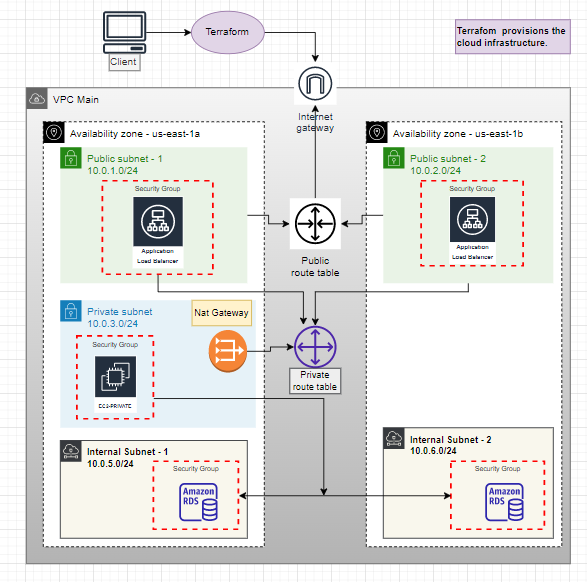
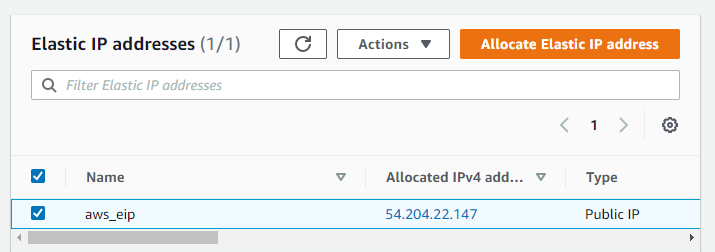
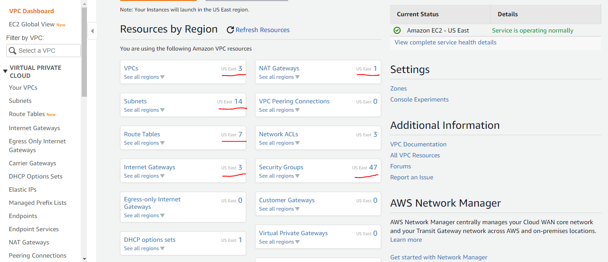

<h1 align=center>Deployment 9: Terraform Challenge</h1>

**Note**: for this documentation, I updated the [README.md](https://github.com/ibrahima1289/DEPLOY_09_TERRAFORM/blob/master/README.md) file from the master branch of this repository.

## Goal: 

Create the following resources in AWS using the latest Terraform version (do not use external modules):

## Architecture:

## Software Tools:

   * **AWS account**: set up an [account](https://docs.aws.amazon.com/polly/latest/dg/setting-up.html) and a user.
   * **Terraform**: here is a [link](https://learn.hashicorp.com/tutorials/terraform/install-cli) to the resource used to install Terraform.

## Procedure:

### Requirements:

#### Part 1 - VPC
1. Create a new VPC with: you can use these terraform files: [vpc.tf](https://github.com/ibrahima1289/DEPLOY_09_TERRAFORM/blob/NAME/DEPLOYMENT9/vpc.tf), [subnet.tf](https://github.com/ibrahima1289/DEPLOY_09_TERRAFORM/blob/NAME/DEPLOYMENT9/subnet.tf), [gateways.tf](https://github.com/ibrahima1289/DEPLOY_09_TERRAFORM/blob/NAME/DEPLOYMENT9/gateways.tf), and [provider.tf](https://github.com/ibrahima1289/DEPLOY_09_TERRAFORM/blob/NAME/DEPLOYMENT9/provider.tf).
  * 5 subnets (2 public, 1 private, 2 internal)
  * 2 route tables (public & private)
  * an Internet Gateway
  * and 1 NAT Gateway (in 1 of the private subnets)

2. Subnets are defined as:
 * Public - route to Internet Gateway (for any ipv4 address)
 * Private - route to NAT Gateway (for any ipv4 address)
 * Internal - do not associate any route table in Terraform (main/default route table will be associated by default which only has a route to the local/private network)

**Note**: You can decide which network range to use.

#### Part 2 - EC2

You can use the [ec2.tf](https://github.com/ibrahima1289/DEPLOY_09_TERRAFORM/blob/NAME/DEPLOYMENT9/ec2.tf) terraform file.
1. Create 1 EC2 instance in the private subnet with:
  * An Ubuntu AMI (version of your choosing)
  * Instance type/size, tags, and other settings of your choosing
2. Create a security group for the EC2 with the following rules:
  * Ingress: allow port 80 traffic from the ALB security group
  * Egress: allow all outbound traffic to any ipv4 address

#### Part 3 - Application Load Balancer (ALB)

You can use this [ALB.tf](https://github.com/ibrahima1289/DEPLOY_09_TERRAFORM/blob/NAME/DEPLOYMENT9/ALB.tf) terraform file.

1. Create 1 ALB in the 2 public subnets
2. Create a security group for the ALB with the following rules:
  * Ingress: allows only port 80 inbound traffic from any ipv4 address
  * Egress: allow only port 80 outbound traffic to the EC2 security group
3. Create a target group and add the EC2 instance to the group
4. Create an ALB listener that forwards traffic to the target group

**Note**: for this exercise the ALB is not accepting HTTPS traffic, only HTTP

#### Part 4 - RDS

You can use this [RDS.tf](https://github.com/ibrahima1289/DEPLOY_09_TERRAFORM/blob/NAME/DEPLOYMENT9/RDS.tf) terraform file.

1. Create 1 PostgreSQL RDS instance
  * Make it multi-az
  * Name, instance type/size, tags, db username/password, and other settings of your choosing
2. Create a security group for the RDS with the following rule:
  * Ingress: allow traffic to its port from the EC2 security group
3. Create a DB subnet group for the RDS consisting of the 2 internal subnets

### The steps:

1. Have all the terraform files we mentioned above in one directory
2. `cd` into that repository.
3. Make sure Terraform is installed by running the command `terraform -v`. Install terraform if you do not have it installed.
4. Set up the [aws cli](https://docs.aws.amazon.com/polly/latest/dg/setup-aws-cli.html) so that Terraform can communicate to **AWS**.
    * In order to set up the aws **credentials**, have the **access key** and **secret access key** ready. Create a **key pair** on AWS if you don't have any.
    * Run the command `aws configure`, then fill out the credentials.

7. Now, run the command `terraform init`.

6. Then, run the command `terraform plan`.

Then enter `yes`

You will see this when the creation is complete:

7. Once the creation of the infrastructure is done, you can visit the AWS console to verify.

8. **Clean up** by running the command `terraform destroy`. **THIS IS TO AVOID HAVING A AWS BILL!**

## Sources Visited:
1. https://harshitdawar.medium.com/launching-a-vpc-with-public-private-subnet-nat-gateway-in-aws-using-terraform-99950c671ce9
2. https://www.cdw.com/content/cdw/en/articles/cloud/aws-vpc-terraform.html
3. https://registry.terraform.io/providers/hashicorp/aws/latest/docs/resources/security_group
4. https://hiveit.co.uk/techshop/terraform-aws-vpc-example/03-create-an-rds-db-instance/
5. https://www.bogotobogo.com/DevOps/Terraform/Terraform-VPC-Subnet-ELB-RouteTable-SecurityGroup-Apache-Server-2.php
  

